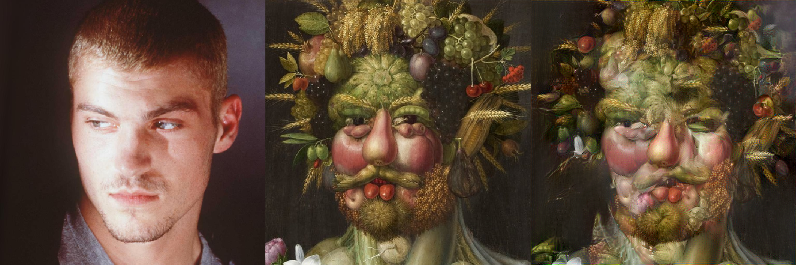
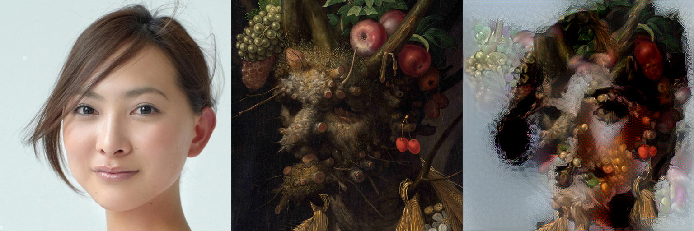

# Object Driven Style Transfer

[<b>Paper</b>](https://github.com/Skittss/object_driven_st/blob/master/objects%20as%20semantics%20in%20style%20transfer.pdf)

<div align='center'>
  
  
</div>

## Prerequisites

Install pip dependencies:
```
pip install -r requirements.txt
``` 
Additionally, Tensorflow 2 with GPU acceleration is strongly recommended ([CUDA](https://developer.nvidia.com/cuda-downloads) and [cuDNN](https://developer.nvidia.com/cudnn) also require installation if used).

## Installation

1. Install [learning-warp-st](https://github.com/xch-liu/learning-warp-st) and place files in `src/liu2021/warping/` (Note `geo_warping.m` should not be overriden).\
Your system must have a valid MATLAB installation (as of 2023/04, R2022b), along with [VLFeat](http://www.vlfeat.org/) and [MatConvNet](http://www.vlfeat.org/matconvnet/).

2. Install [Segment Anything](https://github.com/facebookresearch/segment-anything). As of 2023/04:\
```pip install git+https://github.com/facebookresearch/segment-anything.git```\
and place model `.pth` files in `src/kirillov2023/checkpoints/` (e.g. `sam_vit_h`)

3. (OPTIONAL) Install [gargimahale's implementation of spatially-controlled SST](https://github.com/gargimahale/Doodle) to `src/neural_doodle_compat` (do not overwrite files).\
 This is a tf1 implementation which runs with less memory overhead than the SST implementation provided in this repository (tf2 gradient tape is memory-expensive). Use this option if you encounter memory overflows.

## Usage

As described in the paper, the method can be run on any two images (General ODST), or for headshots on Arcimboldo's works (Arcimboldo ODST). A variety of content and style images that are used in the paper can be found in `images/data/`. Faces are sourced from [CelebAMask-HQ](https://github.com/switchablenorms/CelebAMask-HQ). 

## General ODST
### 1. Run ODST on a content-style image pair.
From the top level directory:
```sh
python src/obj_driven_st.py --cluster -c [CONTENT_PATH] -s [STYLE_PATH] -d [DESTINATION]
```

### 2. Run SST on the content-style image pair and their corresponding semantic segmentations.
A multi-scale SST implementation is provided in this repository, but any segmentation-based SST method can be used in place here.

From the top level directory, a standalone SST:
```sh
python src/gatys2017/spatial_control.py -c [CONTENT_PATH] -csem [CONTENT_SEM_PATH] -s [STYLE_PATH] -ssem [STYLE_SEM_PATH] -d [DESTINATION]
```

And a multi-scale SST (image paths must be changed within the shell script)
```sh
sh src/multi_scale_sst.sh
```
Note, all the images required for this step are automatically exported from step (1). 

## Arcimboldo ODST
From the top level directory:
```sh
python src/arcimboldo_st.py -t [TYPE] -c [CONTENT_PATH] -d [DESTINATION]
```
where TYPE refers to the arcimboldo style to be transferred (e.g. `floral`, `vertumnus`, `four_seasons`).

Then run SST in the same fashion as for General ODST.
